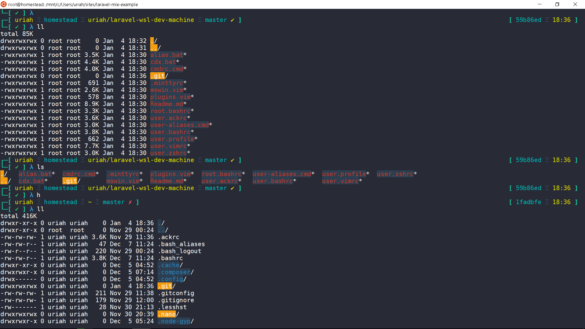

# Setting Up Laravel Dev Machine With WSL 
1. Windows 10 Insiders Build
  [windows 10 build 14971](http://winaero.com/blog/how-to-get-windows-10-build-14971-iso-images)

2. Enable WSL
  [Enable WSL](https://msdn.microsoft.com/en-us/commandline/wsl/install_guide)
  [Commands](https://msdn.microsoft.com/en-us/commandline/wsl/reference)

3. Mintty WSL Latest build
  [Mintty WSL](https://github.com/mintty/wsltty/releases)

4. Enable Hyper V
  [Enable Hyper V](https://blogs.technet.microsoft.com/canitpro/2015/09/08/step-by-step-enabling-hyper-v-for-use-on-windows-10)

5. Install Docker For Windows
  [Stable](https://docs.docker.com/docker-for-windows)

6. Setting Up User For Our Terminal

    1. Create a Zsh User
        This User Will be Using Zsh Command to Allow Us to Beautify Our Terminal and Vim
        ```
        sudo adduser ${username}
        ```
    2. Set Root as the default User
        It is Important That When We Run Bash in WSL the Default User is Root and not Our ZSH User
        Allows Us To Use functions in Our .bash_profile dotfiles using Command bash -ic
        ```
        lxrun /setdefaultuser root
        ```
    3. Update WSL
        ```
        lxrun /update
        ```
7. Creating Neccessary Directories in Windows

    ```
    %USERPROFILE%\bin
    %USERPROFILE%\.dotfiles
    %USERPROFILE%\sites
    ```

    1. Bin folder will hold our Windows Batch Files

        alias.bat ,allows us to CRUD cmd alias from user-aliases.cmd
        cdx.bat allows us to easily navigate in cmd by saving directories
        
    2. .Dotfiles folder will hold our cmd and oh-my-zsh config folder

        1. cmd folder

            - cmdrc.cmd (Requires to Be added in our regedit, Holds Our Core Aliases to Avoid Being Deleted or Override)
            - user-aliases.cmd (Holds All our Laravel Aliases and Other Aliases Added At Run Time)

        2. oh-my-zsh

            - theme/materialshellelectro.zsh.theme (Make Our Zsh Terminal To Look Better)

    3. Sites Folder Will Hold Our Laravel Projects

8. Adding All Necessary Config Files

    [Gists](https://gist.github.com/g0ld3lux/db5c2aa472d7815728a6990abc599df2)
    
    - minttyrc(mintty)
    ```
    %LOCALAPPDATA%\wsltty\home\%USERNAME%\.minttyrc
    ```
    - bashrc(root user)
    ```
    ~/.bashrc
    ```
    - bashrc(zsh user) , important here is that we tell bash to use zsh as our default shell
    ```
    ~/.bashrc
    ```
    - bashprofile(all user)
    ```
    %USERPROFILE%\.dotfiles\.bash_profile
    ```
    - zshrc(zsh user)
    ```
    ~/.zshrc
    ```
    - vimrc (zsh user)
    ```
    ~/.vimrc
    ```
    - plugins.vim (zsh user)
    ```
    ~/.vim/plugins.vim
    ```
    - .ackrc (zsh user) 
    ```
    ~/.ackrc
    ```
    - alias.bat (cmd)
    ```
    %USERPROFILE%\bin\alias.bat
    ```
    - cdx.bat (cmd)
    ```
    %USERPROFILE%\bin\cdx.bat
    ```
    - cmdrc.cmd (cmd)
    ```
    %USERPROFILE%\.dotfiles\cmd\cmdrc.cmd
    ```
9. Installing Beautiful Font to Our Terminal

    [Download Dejavu Sans Mono For Powerline Nerd Font Complete Mono Windows Compatible](https://github.com/ryanoasis/nerd-fonts/blob/master/patched-fonts/DejaVuSansMono/Regular/complete/DejaVu%20Sans%20Mono%20for%20Powerline%20Nerd%20Font%20Complete%20Mono%20Windows%20Compatible.ttf)

10. Installing Vim Vundle for Managing Vim Plugins
    ```
    git clone https://github.com/VundleVim/Vundle.vim.git ~/.vim/bundle/Vundle.vim
    ```

11. Adding Our Custom Themes of Oh-My-Zsh 

    Folder structure 
    ```
    ohmyzsh
    -lib.zsh (optional)
    -plugins 
    -themes  (materialshellelectro.zsh.theme) 
    ```

    [Download Material Shell Electro](https://github.com/carloscuesta/materialshell/blob/master/zsh/materialshellelectro.zsh-theme)

    Save it On
    ```
    %USERPROFILE%\.dotfiles\oh-my-zsh\theme\materialshellelectro.zsh.theme
    ```

12. Generate SSH Key

    Just Google How to Generate Your SSH Key :)

    Save it On 
    ```
    %USERPROFILE%\.ssh
    ```

13. Installing Laravel Dev Dependencies

- Install PHP 7

    always update and upgrade before installing new Packages

    ```
    apt-get install php7.0 # Needed by Laravel
    apt-get install php7.0-mbstring # Needed by Laravel 
    apt-get install php7.0-mysql # Needed for Mysql
    apt-get install php7.0-xml # Needed for phpunit
    apt-get install php7.0-zip # Needed by Composer
    ```

- PHP Modules Optional

    ```
    apt-get install php-redis
    apt-get install php-xdebug
    ```

    To Check if You Have The Following Modules : `php -m`

- Install Composer as root

    ```
    apt-get install unzip
    cd ~
    curl -sS https://getcomposer.org/installer -o composer-setup.php
    ```

    Replace the String for Installer Signature (SHA-384) at this [pubkeys](https://composer.github.io/pubkeys.html)

    ```
    php -r "if (hash_file('SHA384', 'composer-setup.php') === 'aa96f26c2b67226a324c27919f1eb05f21c248b987e6195cad9690d5c1ff713d53020a02ac8c217dbf90a7eacc9d141d') { echo 'Installer verified'; } else { echo 'Installer corrupt'; unlink('composer-setup.php'); } echo PHP_EOL;"
    php composer-setup.php --install-dir=/usr/local/bin --filename=composer
    ```

    Change User to you Zsh user then invoke composer command to create  a .composer folder and change ownership of .composer folder

    ```
    su <username>
    composer
    sudo chown -R $USER $HOME/.composer
    ```

    Check the Settings of Composer if Correct
    ```
    curl -sS https://getcomposer.org/installer | php -- --check
    ```

    if You need to Disable/Enable xdebug 

    ```
    phpdismod xdebug
    phpennmod xdebug
    ```

    You need to configure this for both user

    ```
    composer self-update --update-keys
    ```

    You need to get the Keys  here [pubkeys](https://composer.github.io/pubkeys.html)


    and paste the Value in the Terminal to Set it up

- Install Laravel Installer

    ```
    composer global require "laravel/installer"
    ```

    We already have the path added in our Config So the Path is Available Already
    We Have alias of laravel available to our Use

    ```
    laravel new blog
    ```

    This will Create a New Laravel Project Much Faster Using Cache

- Optimize Speed of Composer with Pretissimo

    Best Use if you Have High Download Speed you can set higher Concurrency default is 6

    ```
    composer global require "hirak/prestissimo:^0.3"
    ```

    We have alias of newapp

    ```
    newapp laravel
    ```

    This will Create a New Laravel Project with benchmark

- NodeJS

    ```
    curl -sL https://deb.nodesource.com/setup_6.x | sudo -E bash -
    sudo apt-get install -y nodejs
    sudo apt-get install -y build-essential
    ```

    Check if it is Installed

    ```
    node -v
    npm -v
    ```

- Gulp

    ```
    npm install --global gulp-cli
    ```

    Check if Installed Globally

    ```
    gulp -v
    ```
    
- Webpack
  
  ```
  npm install --global webpack
  ```

- Yarn

    ```
    curl -sS https://dl.yarnpkg.com/debian/pubkey.gpg | sudo apt-key add -
    echo "deb http://dl.yarnpkg.com/debian/ stable main" | sudo tee /etc/apt/sources.list.d/yarn.list
    sudo apt-get update && sudo apt-get install yarn
    ```

    Check if Installed 

    ```
    yarn -V
    ```

- Install ZSH

    ```
    apt-get update
    apt-get upgrade
    apt-get install zsh
    ```

- Install Oh-My-Zsh

    ```
    su <zshuser>
    git clone git://github.com/robbyrussell/oh-my-zsh.git ~/.oh-my-zsh
    chsh -s /bin/zsh
    ```

    By Default if You Added our Zshrc config file
    It will already Use ZSH as the default Shell everytime we log in using our Zsh User


-  Installing Vim Plugins 

    if You already have copied our plugins.vim config and vimrc

    ```
    vim
    ,ep
    :PluginInstall
    ```

- Refining Our Search 

    Install  Ack and Exuberant Tag

    ```
    apt-get install exuberant-ctags
    apt-get install ack-grep
    ```

    We have aliases for ctags , TagsInit

    Ackrc can be defined per project or use our Global ackrc file that we added in our User ~/.ackrc

- Install VS Code Insiders As Our Default Text Editor

    ```
    https://code.visualstudio.com/insiders
    ```

    We Have alias code ready to be used in both bash and cmd terminal 

- Install ConEmu to Decorate Our CMD terminal

    This will Give Us the Ability to Use Ctrl ` (backtick) to toggle Terminal Globally

    Very Useful Short Cut Key

    Set Up Settings


    - Colorscheme = Ubuntu
    - Default Term = Force ConEmu as Default Terminal for Console Applications
    - Windows Size = Maximized
    - Quake Style = 120 ms, Quake style slide down , autohide on focus lose
    - Add task for mintty , you can also make this as default task when conemu is run!
    ```
    *%LOCALAPPDATA%\wsltty\bin\mintty.exe /bin/wslbridge -t /usr/bin/ssh-agent /bin/zsh -l -new+console:d:%USERPROFILE%
    ```
    - Tab Bar is Auto Show (Only Show if you Have 2 or more Tabs)
    - Status Bar Removed (Make it Minimal as Possible)
    - Set Font DejaVuSansMonoForPowerline NF
